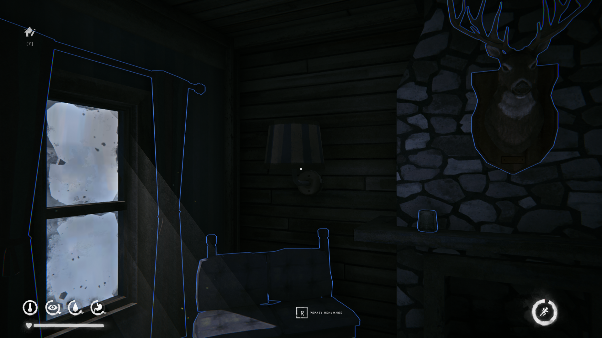
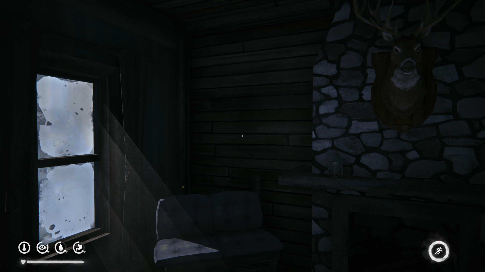

# Farmhouse Wardrobe Fix

A source project and MelonLoader mod for **The Long Dark**. It removes the
blocked wardrobe section in the Pleasant Valley Farmhouse, repairs the baked
shadow left in the BC7 lightmap, and can persistently hide additional
user-selected scene objects.

Documentation:

- [English](README_EN.md)
- [Русский](README_RU.md)

Current release: **1.0.0**  
Author: **Dwinfear + ChatGPT**

## Preview

### Before

### After

